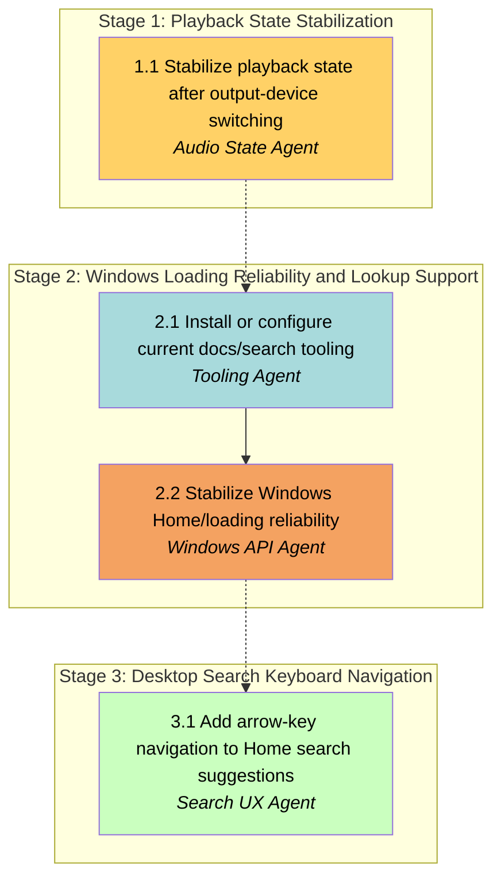

# APM Plan

## Workers

| Worker | Domain | Description |
|---|---|---|
| Audio State Agent | Playback stability | Repairs playback state synchronization after Windows audio-device switching and keeps play/loading UI aligned with the actual player state. |
| Tooling Agent | Docs and lookup support | Installs or configures MCP-based documentation/web search support for current implementation work without changing app behavior. |
| Windows API Agent | Windows streaming reliability | Stabilizes the current YouTube/innertube-based loading and search flow on Windows without replacing the implementation stack yet. |
| Search UX Agent | Desktop search interaction | Adds arrow-key and Enter navigation to the Home search suggestions/history list on desktop only. |

## Stages

| Stage | Name | Tasks | Agents |
|---|---|---:|---|
| 1 | Playback State Stabilization | 1 | Audio State Agent |
| 2 | Windows Loading Reliability and Lookup Support | 2 | Tooling Agent; Windows API Agent |
| 3 | Desktop Search Keyboard Navigation | 1 | Search UX Agent |

## Dependency Graph

---

> **Notes:** Stage 1 is the critical-path fix because the player state bug can masquerade as loading or broken playback and makes later validation noisy. Stage 2 is split so the lookup/tooling support lands before the Windows loading investigation, since that task is the most uncertain and may need fresh references during implementation. Stage 3 is intentionally isolated; it should only start after the Windows search/loading behavior is stable enough to avoid confounding keyboard-navigation validation with unrelated loading regressions. Final confirmation for the user should include local checks plus the GitHub Windows build task as the external build-confidence gate.

## Stage 1: Playback State Stabilization

### Task 1.1: Stabilize playback state after output-device switching - Audio State Agent

* **Objective:** Keep the player UI and playback state aligned when Windows automatically switches between speakers and Bluetooth headphones.
* **Output:** Updates to the playback-state reconciliation path in the audio/player layer, with any necessary Windows-specific adjustments to keep loading, playing, paused, and completed states consistent.
* **Validation:** `flutter analyze` passes for touched files; a focused local playback smoke check confirms that device switching no longer leaves the UI stuck in loading; the player can recover without requiring a restart; the GitHub Windows build task is green before the task is considered done.
* **Guidance:** Work in the existing GetX/audio_service architecture. Start from `lib/services/audio_handler.dart`, `lib/ui/player/player_controller.dart`, and `lib/services/windows_audio_service.dart`. Preserve Linux/Android behavior if shared logic is touched. The fix should reconcile state changes, not change the user’s audio device selection behavior.
* **Dependencies:** None

1. Trace the current loading/playback state flow from the audio handler into the player controller and identify where Windows device switching leaves stale state behind.
2. Adjust the state reconciliation path so play/loading indicators reflect the actual player state after automatic output changes.
3. Verify the modified path with a focused local check and capture any edge cases that still need review before the Windows build gate.

## Stage 2: Windows Loading Reliability and Lookup Support

### Task 2.1: Install or configure current docs/search tooling - Tooling Agent

* **Objective:** Add a lightweight MCP-based documentation or web-search setup that can be used during the current implementation work.
* **Output:** Workspace/editor-level MCP or equivalent lookup configuration that can resolve current Flutter, YouTube API, and Windows audio references without modifying app runtime behavior.
* **Validation:** The configured tool is discoverable from the workspace, and a simple current-docs or web-search query returns a usable result; the Flutter app build path is unchanged and still clean.
* **Guidance:** Keep this isolated from app code whenever possible. Prefer the smallest viable setup that satisfies the need for current documentation and web lookup. If a package or configuration change is unavoidable, keep it local and explain why it is required.
* **Dependencies:** **Task 1.1 by Audio State Agent**

1. Evaluate the least invasive way to provide fresh docs/web lookup inside the workspace or editor environment.
2. Install or configure the chosen MCP/server integration and confirm it can resolve a live lookup query.
3. Record the usable setup path so the later Windows API task can rely on it without re-discovering the configuration.

### Task 2.2: Stabilize Windows Home/loading reliability - Windows API Agent

* **Objective:** Stop the Windows Home tab and top search flow from getting stuck in loading or failing to render results while keeping the current innertube/youtube_explode_dart implementation.
* **Output:** Targeted fixes in the YouTube request/loading pipeline and the Home/search result controllers or widgets that clear stale loading states and restore consistent result rendering for songs, playlists, albums, and artists.
* **Validation:** `flutter analyze` passes on touched files; focused Windows smoke checks show Home and search results resolve consistently instead of hanging in loading; playlists continue to work; the GitHub Windows build task is green before the task is considered done.
* **Guidance:** Do not replace the API layer with a new implementation in this session. Investigate the current request lifecycle, loading flags, and result propagation in `lib/services/music_service.dart`, `lib/services/stream_service.dart`, `lib/services/background_task.dart`, `lib/ui/screens/Home/home_screen.dart`, and the search result controllers/widgets as needed. Preserve the current working playlist behavior while fixing the stuck-loading cases.
* **Dependencies:** **Task 2.1 by Tooling Agent**

1. Use the newly available tooling to inspect current docs and any relevant implementation references for the Windows loading path.
2. Trace how Home and search requests transition into loading and how results are surfaced to the UI, then patch the stale-state path that leaves sections searching indefinitely.
3. Confirm the Windows-facing flow now clears loading and displays results consistently before handing the app to the keyboard-navigation stage.

## Stage 3: Desktop Search Keyboard Navigation

### Task 3.1: Add arrow-key navigation to Home search suggestions - Search UX Agent

* **Objective:** Enable desktop-only Up/Down/Enter navigation within the Home search suggestions and history list.
* **Output:** Updated Home search UI/controller logic so the suggestion list can be highlighted with arrow keys, Enter replaces the search bar text and triggers the search, and the user can return to typing mode by moving up past the list.
* **Validation:** A focused desktop run or widget-level keyboard test shows the first result highlights on Down, Up cycles backward, Enter replaces the search text and starts the search, and the existing spacebar behavior remains unchanged; the GitHub Windows build task is green before the task is considered done.
* **Guidance:** Keep the scope limited to the Home search suggestions/history surface on desktop. Start with `lib/ui/screens/Search/components/desktop_search_bar.dart` and the associated search controllers/widgets. Reuse the existing search text replacement path if it already exists in the search-result UI instead of inventing a second behavior. Do not add category browsing, tab navigation, or mobile-only changes.
* **Dependencies:** **Task 2.2 by Windows API Agent**

1. Add or extend keyboard focus handling so the Home search suggestion list can track a highlighted row independently of pointer clicks.
2. Wire Enter to the existing text replacement/search launch path so the selected suggestion replaces the search box contents and immediately begins searching.
3. Validate that the desktop Home search surface behaves as requested without changing unrelated search or spacing behavior.

