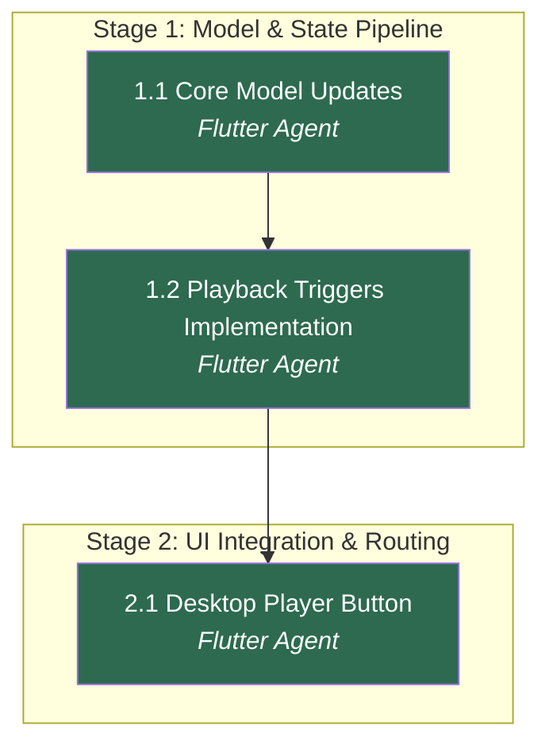

# APM Plan

## Workers
| Worker | Domain | Description |
|---|---|---|
| Flutter Agent | Frontend & State | Handles the GetX state modifications, data models, and Flutter UI components. |

## Stages
| Stage | Name | Tasks | Agents |
|---|---|---|---|
| 1 | Model & State Pipeline | 2 | Flutter Agent |
| 2 | UI Integration & Routing | 1 | Flutter Agent |

## Dependency Graph

---

> **Notes:**
> - All work resides within the Flutter Domain, so a single Worker handles implementation sequentially.
> - The critical path relies on `PlaylingFrom` model changes compiling successfully before screen dependencies can be handled.

## Stage 1: Model & State Pipeline

### Task 1.1: Core Model & Controller Updates - Flutter Agent
* **Objective:** Extend the `PlaylingFrom` model to hold an ID and prepare the `PlayerController` for receiving it.
* **Output:** Modified `lib/models/playling_from.dart` and `lib/ui/player/player_controller.dart`.
* **Validation:** Dart analyzer reports no errors in the modified files.
* **Guidance:** Add `String? id;` to the `PlaylingFrom` model's constructor properties as an optional named parameter. Update `PlayerController`'s playback tracking functions to properly instantiate `PlaylingFrom` with the `id` argument where appropriate, falling back to null when not in an Album or Playlist.
* **Dependencies:** None

1. Update `lib/models/playling_from.dart` constructor to accept `this.id`.
2. Update internal instantiations of `PlaylingFrom` inside `lib/ui/player/player_controller.dart` to optionally forward this `id`.

### Task 1.2: Playback Triggers Implementation - Flutter Agent
* **Objective:** Ensure all navigation & playback screens provide their browseId/playlistId to the player controller.
* **Output:** Modified caller instances (e.g., `lib/ui/screens/Album/album_screen.dart`, `lib/ui/screens/Playlist/playlist_screen.dart`, `lib/utils/app_link_controller.dart`).
* **Validation:** Modified files compile without Dart analyzer errors.
* **Guidance:** Search the workspace for `playfrom:` and `PlaylingFromType` to locate all source trigger points. Provide the active playlist/album identifier into the `id` field of the instantiated `PlaylingFrom` object (e.g., `playfrom: PlaylingFrom(type: PlaylingFromType.PLAYLIST, id: list.browseId)`).
* **Dependencies:** Task 1.1

1. Identify all `playPlayListSong` and `pushSongToQueue` call sites in the UI screens.
2. Edit those usages to include the list's `id` inside their `PlaylingFrom` payload.

## Stage 2: UI Integration & Routing

### Task 2.1: Desktop Player Button Integration - Flutter Agent
* **Objective:** Add the return navigation button into the desktop panel and wire up its GetX logic.
* **Output:** Modified `lib/ui/player/components/mini_player.dart`.
* **Validation:** UI code compiles without errors; the button renders strictly between the "Up Next" and "Sleep Timer" buttons for size.width > 860.
* **Guidance:** 
  - Locate `size.width > 860` in `mini_player.dart`. 
  - Identify the "Up Next" (`Icons.queue_music`) and "Sleep Timer" (`Icons.timer`) buttons.
  - Insert an `IconButton` directly between them using an appropriate icon like `Icons.library_music` or `Icons.album`.
  - In its `onPressed` handler, check `playerController.playinfrom.value`. If the `id` exists and it is a Playlist or Album type, execute the routing step described in the Spec: `Get.toNamed(ScreenNavigationSetup.playlistScreen, id: ScreenNavigationSetup.id, arguments: [null, id])` or equivalent for Album.
* **Dependencies:** Task 1.2

1. Edit `lib/ui/player/components/mini_player.dart` to insert the new button between the defined target icons.
2. Apply the click handler logic strictly checking enum type and forwarding to GetX routes.

